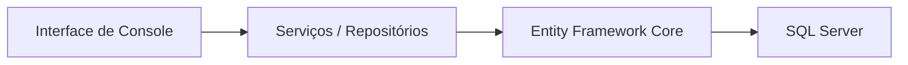

# Sprint3 – Grupo 7 do Challenge

## Estrutura do projeto

```
Sprint3/
  Sprint3.sln
  Sprint3.Core/
    Enums/Perfil.cs
    Models/Cliente.cs
    Models/Ativo.cs
    Models/Carteira.cs
    Interfaces/IRepositorioCliente.cs
    Interfaces/IRepositorioAtivo.cs
    Interfaces/IServicoArquivo.cs
  Sprint3.Infrastructure/
    Data/AppDbContext.cs
    Repositories/RepositorioCliente.cs
    Repositories/RepositorioAtivo.cs
    Services/ServicoArquivo.cs
    appsettings.json
  Sprint3.Console/
    Program.cs
    appsettings.json
  Data/ativos_exemplo.json
  Data/ativos_exemplo.txt
  README.md
```

## Uso

O menu apresenta opções para importar ativos de arquivos JSON/TXT, cadastrar/listar/atualizar/excluir clientes e ativos. Siga as instruções na tela. Dois arquivos de exemplo estão disponíveis na pasta `Data/`.

## Diagrama (Mermaid)

O fluxo de camadas do projeto é representado em Mermaid (renderizado pelo GitHub):



