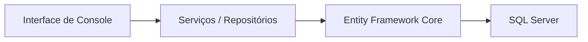

# Sprint3 – Grupo 7 do Challenge

Este projeto é um exercício acadêmico simples em **C# (.NET 8)**, feito por um estudante para demonstrar conhecimentos básicos de leitura de arquivos, persistência de dados com **Entity Framework Core** e uma interface de menu em console. O objetivo é cumprir a rubrica da disciplina, de forma didática, sem códigos complexos.

## Estrutura do projeto

```
Sprint3/
  Sprint3.sln
  Sprint3.Core/
    Enums/Perfil.cs
    Models/Cliente.cs
    Models/Ativo.cs
    Models/Carteira.cs
    Interfaces/IRepositorioCliente.cs
    Interfaces/IRepositorioAtivo.cs
    Interfaces/IServicoArquivo.cs
  Sprint3.Infrastructure/
    Data/AppDbContext.cs
    Repositories/RepositorioCliente.cs
    Repositories/RepositorioAtivo.cs
    Services/ServicoArquivo.cs
    appsettings.json
  Sprint3.Console/
    Program.cs
    appsettings.json
  Data/ativos_exemplo.json
  Data/ativos_exemplo.txt
  README.md
```

## Configuração rápida

1. Instale o **.NET SDK 8.0** ou superior e um **SQL Server** (pode ser Express ou LocalDB).
2. Ajuste a `ConnectionString` em `Sprint3.Infrastructure/appsettings.json` e `Sprint3.Console/appsettings.json` para o seu servidor:
   ```json
   "ConnectionStrings": {
     "DefaultConnection": "Server=localhost;Database=Sprint3Db;User Id=sa;Password=SuaSenhaForte;TrustServerCertificate=True"
   }
   ```
3. No terminal, execute a aplicação:
   ```bash
   dotnet build
   dotnet run --project Sprint3.Console
   ```

## Uso

O menu apresenta opções para importar ativos de arquivos JSON/TXT, cadastrar/listar/atualizar/excluir clientes e ativos. Siga as instruções na tela. Dois arquivos de exemplo estão disponíveis na pasta `Data/`.

## Diagrama (Mermaid)

O fluxo de camadas do projeto é representado em Mermaid (renderizado pelo GitHub):



## Observações

- Este projeto **não** possui lógica de recomendação de investimentos.
- Comentários e mensagens são simples e em português.
- Foi desenvolvido para fins educacionais pelo **Grupo 7 do Challenge**.
